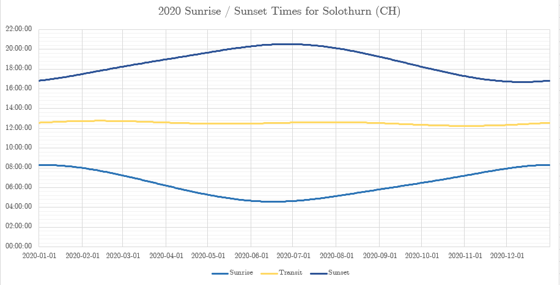

# ☀️ lib Daylength

C Library to calculate Sunrise, Sunset and Daylength times.

---

This library intends to bring daylength calculations to microcontroller plattforms without the use of a internet cloud API.



---

### Mathematics

The mathematics are explained in detail in this paper: [aa.quae.nl](https://www.aa.quae.nl/en/reken/zonpositie.html)

However, many things can be approximated. 
The calculations in the source code are taken from: [users.electromagnetic.net](http://users.electromagnetic.net/bu/astro/iyf-calc.php)

---

### Example Implementation on STM32

```c
    RTC_DateTypeDef sDate;
    RTC_TimeTypeDef sTime;
    
    sDate.Year = 20;
    sDate.Month = RTC_MONTH_MARCH;
    sDate.Date = 6;
    sDate.WeekDay = RTC_WEEKDAY_THURSDAY;
    
    sTime.Hours = 23;
    sTime.Minutes = 59;
    sTime.Seconds = 59;
    
    // Start the RTC with current date
    HAL_RTC_SetDate(&hrtc, &sDate, RTC_FORMAT_BIN);
    HAL_RTC_SetTime(&hrtc, &sTime, RTC_FORMAT_BIN);
    
    // initialize UNIX Timestamp struct with RTC values
    UNIXTimestamp_t st;
    st.year = sDate.Year+2000;
    st.month = sDate.Month;
    st.day = sDate.Date;
    st.hour = sTime.Hours;
    st.minute = sTime.Minutes;
    st.second = sTime.Seconds;
    
    UNIXTimestamp_t sR;      // return variable
    double lon = 47.207447;   // longitude of Solothurn
    double lat = 7.537179;    // latitude of Solothurn
    
  /* USER CODE END 2 */

  /* Infinite loop */
  /* USER CODE BEGIN WHILE */
  while (1)
  {
    /* USER CODE END WHILE */

    /* USER CODE BEGIN 3 */
        // update current date and time
        HAL_RTC_GetDate(&hrtc, &sDate, RTC_FORMAT_BIN);
        HAL_RTC_GetTime(&hrtc, &sTime, RTC_FORMAT_BIN);
        printf("RTC: %02d:%02d:%02d\n", sTime.Hours, sTime.Minutes, sTime.Seconds);
        
        st.year = sDate.Year+2000;
        st.month = sDate.Month;
        st.day = sDate.Date;
        st.hour = sTime.Hours;
        st.minute = sTime.Minutes;
        st.second = sTime.Seconds;
        
        // calculate sunrise
        sR = getSunrise(&st, lon, lat);
        printf("UNIX: %d-%02d-%02d %02d:%02d:%02d\n", st.year, st.month, st.day, st.hour, st.minute, st.second);
        printf("Rise: %d-%02d-%02d %02d:%02d:%02d\n", sR.year, sR.month, sR.day, sR.hour, sR.minute, sR.second);
        // calculate sunset
        sR = getSunset(&st, lon, lat);
        printf("Set : %d-%02d-%02d %02d:%02d:%02d\n", sR.year, sR.month, sR.day, sR.hour, sR.minute, sR.second);
        
        HAL_Delay(1000);
        HAL_GPIO_TogglePin(LD2_GPIO_Port, LD2_Pin);
  }
  /* USER CODE END 3 */
```

**Output**

```
RTC:  23:59:59
UNIX: 2020-03-06 23:59:59
Rise: 2020-03-05 07:03:40
Set : 2020-03-05 18:22:23
RTC:  00:00:00
UNIX: 2020-03-07 00:00:00
Rise: 2020-03-06 07:01:43
Set : 2020-03-06 18:23:51

```


### Todo / Known Issues

- date seems incorrect (see output above)
- Todo: add/subtract GMT difference (Timezone Support)
- Todo: 

